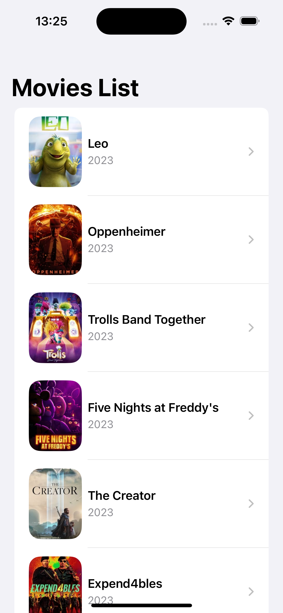
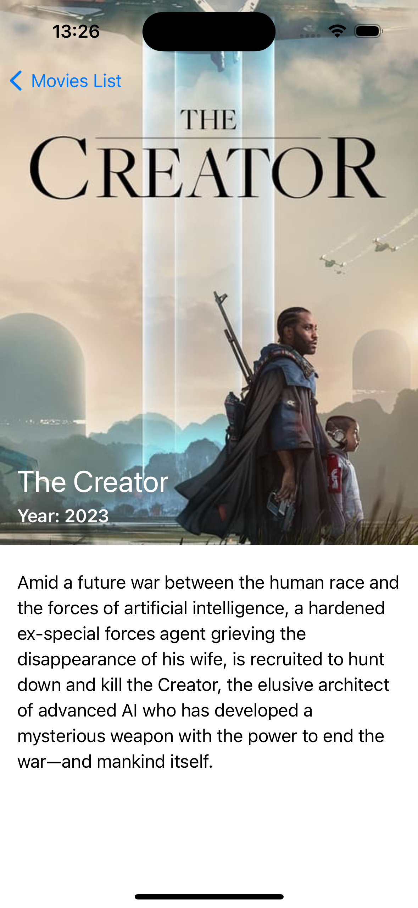

<!--
*** Thanks for checking out the Best-README-Template. If you have a suggestion
*** that would make this better, please fork the repo and create a pull request
*** or simply open an issue with the tag "enhancement".
*** Thanks again! Now go create something AMAZING! :D
-->


<!-- PROJECT SHIELDS -->
<!--
*** I'm using markdown "reference style" links for readability.
*** Reference links are enclosed in brackets [ ] instead of parentheses ( ).
*** See the bottom of this document for the declaration of the reference variables
*** for contributors-url, forks-url, etc. This is an optional, concise syntax you may use.
*** https://www.markdownguide.org/basic-syntax/#reference-style-links
-->
[![Contributors][contributors-shield]][contributors-url]
[![Issues][issues-shield]][issues-url]
[![MIT License][license-shield]][license-url]
[![LinkedIn][linkedin-shield]][linkedin-url]


<!-- PROJECT LOGO -->
<br />
<p align="center">
  <a href="https://github.com/othneildrew/Best-README-Template">
    
  </a>

  <h3 align="center">Movies Application</h3>

  <p align="center">
    Simple UI to show list of movies and thier details
  
</p>


<!-- TABLE OF CONTENTS -->
<details open="open">
  <summary>Table of Contents</summary>
  <ol>
    <li>
      <a href="#about-the-project">About The Project</a>
      <ul>
        <li><a href="#built-with">Built With</a></li>
      </ul>
    </li>
    <li>
      <a href="#getting-started">Getting Started</a>
      <ul>
        <li><a href="#prerequisites">Prerequisites</a></li>
        <li><a href="#installation">Installation</a></li>
      </ul>
    </li>
    <li><a href="#architecture">Architecture</a></li>
    <li><a href="#folders-structure">Folders Structure</a></li>
    <li><a href="#license">License</a></li>
    <li><a href="#contact">Contact</a></li>
    <li><a href="#acknowledgements">Acknowledgements</a></li>
  </ol>
</details>


<!-- ABOUT THE PROJECT -->
## About The Project

IOS application that displays the list of trending movies, when we select one movie it shows more details about it. As a data provider for more [details](./Requirements.pdf) 

| List | Details |
|  :---:  |  :---:  |
|  |  |


### Built With

This section should list any major frameworks that you built your project using. Leave any add-ons/plugins for the acknowledgements section. Here are a few examples.
* [XCode](https://getbootstrap.com)
* [Bazel](https://docs.bazel.build/versions/5.0.0/tutorial/ios-app.html)


<!-- GETTING STARTED -->
## Getting Started

This is an example of how you may give instructions on setting up your project locally.
To get a local copy up and running follow these simple example steps.

### Prerequisites

at the current state you have to install the pre requisites manually at more advanced state can setup the 
* Swiftlint
  ```sh
  brew install swiftlint
  ```

### Installation
* Select the build scheme which can be found right after the stop button on the top left of the IDE
* [Command(cmd)] + B - Build app
* [Command(cmd)] + R - Run app


<!-- Architecture -->
## Architecture

Using a modular architecture where you have couple of modules contains the functionality could be used later on by SPM or on other choice according to the business logic and tech team needs. 

Used basic MVVVM architecture to apply the use case needs, for more advanced usage could be there better alternative like RIBs, Viper, Clean Architecture, ...etc

Used both [SwiftLint](https://github.com/realm/SwiftLint), [SwiftFormat](https://github.com/nicklockwood/SwiftFormat) by Homebrew. 


## Folders Structure
* Modules: Include separate modules, components, extensions, ...etc.
* Scenes: Group of app UI screens.


<!-- LICENSE -->
## License

Distributed under the MIT License. See `LICENSE` for more information.


<!-- CONTACT -->
## Contact

Abozaid Ibrahim - [@https://linkedin.com/in/abozaid-ibrahim](https://linkedin.com/in/abozaid-ibrahim) - abozaid.ibrahim11@gmail.com


<!-- ACKNOWLEDGEMENTS -->
## Acknowledgements
* [GitHub Emoji Cheat Sheet](https://www.webpagefx.com/tools/emoji-cheat-sheet)


<!-- MARKDOWN LINKS & IMAGES -->
<!-- https://www.markdownguide.org/basic-syntax/#reference-style-links -->
[contributors-shield]: https://img.shields.io/github/contributors/abozaid-ibrahim/repo.svg?style=for-the-badge
[contributors-url]: https://github.com/abozaid-ibrahim/MoviesApplication/graphs/contributors
[issues-shield]: https://img.shields.io/github/issues/abozaid-ibrahim/repo.svg?style=for-the-badge
[issues-url]: https://github.com/abozaid-ibrahim/MoviesApplication/issues
[license-shield]: https://img.shields.io/github/license/abozaid-ibrahim/repo.svg?style=for-the-badge
[license-url]: https://github.com/abozaid-ibrahim/MoviesApplication/blob/master/LICENSE.txt
[linkedin-shield]: https://img.shields.io/badge/-LinkedIn-black.svg?style=for-the-badge&logo=linkedin&colorB=555
[linkedin-url]: https://linkedin.com/in/abozaid-ibrahim
